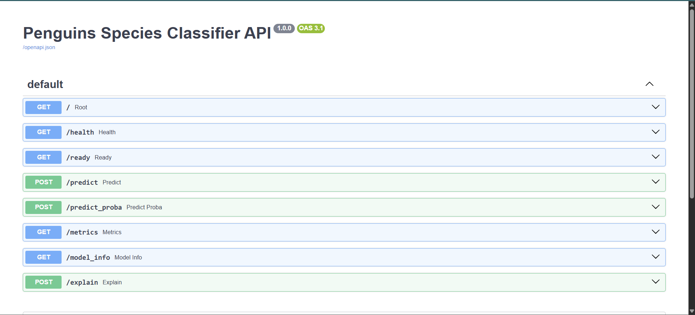
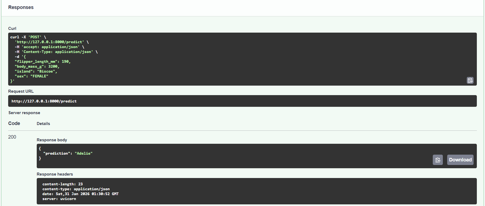
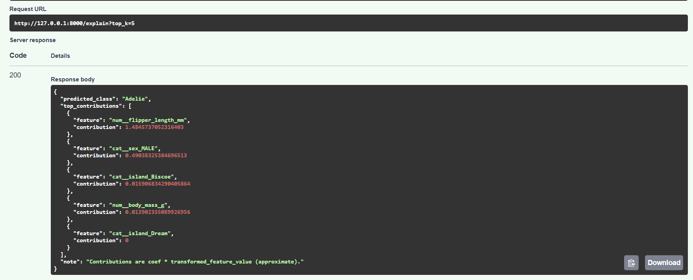

# FastAPI Lab – Penguins Species Classification (Customized)


## Overview

This lab demonstrates how to expose a machine learning model as a REST API using **FastAPI** and **uvicorn**.

The original lab trained a Decision Tree model on the Iris dataset.  
**This version has been customized** to ensure originality and to better reflect a real-world MLOps workflow.

### What’s different in this version?

- **Dataset**: Penguins dataset (CSV-based, tabular, real-world style)
- **Task**: Multiclass classification of penguin species
- **Classes**: Adelie, Chinstrap, Gentoo
- **Model**: Scikit-learn Pipeline  
  - OneHotEncoder (categorical features)  
  - StandardScaler (numerical features)  
  - Logistic Regression classifier
- **Additional artifacts**: metrics and model metadata
- **New API endpoints** beyond basic prediction

---

## Project Structure

```text
FastAPI_Labs
├── assets/
├── data/
│   └── penguins.csv
├── model/
│   ├── penguins_model.pkl
│   ├── metrics.json
│   └── model_card.json
├── src/
│   ├── __init__.py
│   ├── data.py
│   ├── train.py
│   ├── predict.py
│   └── main.py
├── fastapi_penguins_env/
├── requirements.txt
└── README.md
```
---
## Dataset

The **penguins.csv** dataset contains measurements of penguins and is used to predict the species.

### Features

- `flipper_length_mm` (numeric)
- `body_mass_g` (numeric)
- `island` (categorical)
- `sex` (categorical)

### Target

- `species` → Adelie / Chinstrap / Gentoo

## Running the Lab

1. First step is to train the machine learning model.  
   Although a trained model file may already exist in the repository, we will train a new model using the Penguins dataset.

   Move into the src/ folder:
   ```bash
   cd src
   ```

2. Train the Penguins classification model by running:
    ```bash
   python train.py
    ```
   This step will generate the following artifacts inside the model directory:
   - penguins_model.pkl
   - metrics.json
   - model_card.json

3. To serve the trained model as a REST API using FastAPI, run:
    ``` bash
   python -m uvicorn main:app --reload
    ```
4. Testing the API endpoints:

   After starting the FastAPI server, open the interactive API documentation in your browser:

   http://127.0.0.1:8000/docs  
   http://localhost:8000/docs

   You can test all available endpoints directly from the FastAPI UI by clicking “Try it out”, providing the request body, and executing the request.



You can look at the avilable endpoints here.

You can make predictions using [http://127.0.0.1:8000/predict](http://127.0.0.1:8000/predict) and look at the probabilities using [http://127.0.0.1:8000/predict_proba](http://127.0.0.1:8000/predict_proba) endpoint. 
 


You can also use the [http://127.0.0.1:8000/explain](http://127.0.0.1:8000/explain) endpoint to look at the most contributing featues for model interpretability. 

.

### Note on the Endpoints

The `/predict` and `/predict_proba` and `/explain` endpoints are defined as **POST** endpoints and require a JSON request body.  
Because of this, they **cannot be accessed directly by typing the URL in a web browser**, which always sends a GET request.


To use these endpoints correctly, you must send a **POST request** using one of the following methods:

- The FastAPI interactive documentation at `/docs`
- Command-line tools such as `curl`
- API clients such as Postman or Thunder Client

Endpoints such as `/health`, `/metrics`, and `/model_info` work directly in the browser because they are defined as **GET** endpoints.


