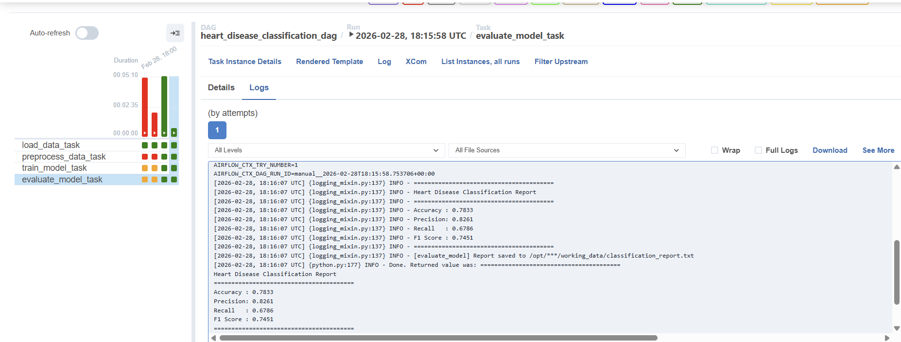

# Airflow Lab 1 — Heart Disease Classification Pipeline

## Overview

This lab demonstrates an end-to-end **supervised classification pipeline** orchestrated with Apache Airflow. It uses the [Heart Disease UCI dataset](https://www.kaggle.com/datasets/redwankarimsony/heart-disease-data) to predict the presence of heart disease in patients using a **Random Forest classifier**.

This is a modification of the original Airflow Lab 1, which implemented an unsupervised K-Means clustering pipeline. The key changes are:

| | Original Lab | This Lab |
|---|---|---|
| Task type | Unsupervised clustering | Supervised classification |
| Model | K-Means + Elbow method | Random Forest |
| Dataset | Generic CSV | Heart Disease UCI |
| Evaluation | Number of clusters | Accuracy, Precision, Recall, F1 |
| Output | Saved `.pkl` model | Model + classification report `.txt` |

---

## Pipeline Structure

The DAG `heart_disease_classification_dag` consists of 4 sequential tasks:

```
load_data_task → preprocess_data_task → train_model_task → evaluate_model_task
```

| Task | Function | Description |
|---|---|---|
| `load_data_task` | `load_data()` | Loads `heart.csv` and serializes it for downstream tasks |
| `preprocess_data_task` | `preprocess_data()` | Drops irrelevant columns, binarizes target, encodes categoricals, scales features, splits into train/test |
| `train_model_task` | `train_model()` | Trains a Random Forest classifier and saves the model to disk |
| `evaluate_model_task` | `evaluate_model()` | Loads the model, runs inference, computes metrics, and saves a report |

---

## Dataset

**Heart Disease UCI** — 920 patient records from 4 institutions (Cleveland, Hungary, Switzerland, VA Long Beach).

- **Target column**: `num` — binarized to `0` (no disease) and `1` (disease present)
- **Features**: age, sex, chest pain type, resting blood pressure, cholesterol, fasting blood sugar, ECG results, max heart rate, exercise-induced angina, ST depression, slope, number of vessels, thalassemia type

---

## DAG Run



The screenshot above shows all 4 tasks completing successfully, with the `evaluate_model_task` logs displaying the final classification metrics.

---

## Results

```
========================================
Heart Disease Classification Report
========================================
Accuracy : 0.7833
Precision: 0.8261
Recall   : 0.6786
F1 Score : 0.7451
========================================
```

The full report is saved to `working_data/classification_report.txt` after each DAG run.

---

## Setup & Installation

### Prerequisites
- Docker Desktop (4GB+ memory allocated, 8GB recommended)

### Steps

1. Clone the repository and navigate to the lab directory:
    ```bash
    cd Labs/Airflow_Labs/Lab_1
    ```

2. Create required directories and `.env` file (Windows PowerShell):
    ```powershell
    mkdir logs, plugins, working_data -Force
    [System.IO.File]::WriteAllText("$PWD\.env", "AIRFLOW_UID=50000`n", [System.Text.UTF8Encoding]::new($false))
    ```

3. Initialize the Airflow database:
    ```bash
    docker compose up airflow-init
    ```

4. Start Airflow:
    ```bash
    docker compose up
    ```

5. Visit `http://localhost:8081` and log in with:
    - **Username**: `airflow2`
    - **Password**: `airflow2`

6. Trigger the `heart_disease_classification_dag` DAG manually from the UI.

---

## Project Structure

```
Lab_1/
├── config/
│   └── airflow.cfg
├── dags/
│   ├── data/
│   │   └── heart.csv
│   └── src/
│       ├── __init__.py
│       └── lab.py              # Core pipeline functions
├── working_data/               # Model + report saved here after DAG runs
├── airflow.py                  # DAG definition
├── docker-compose.yaml
├── setup.sh
└── README.md
```

---

## Dependencies

The following packages are installed automatically via Docker:
- `pandas`
- `scikit-learn`