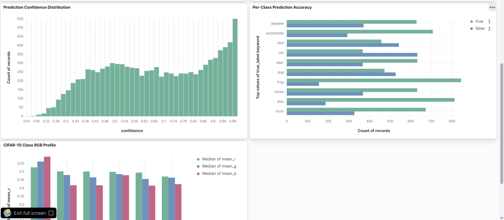
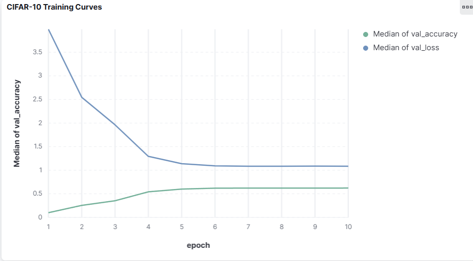
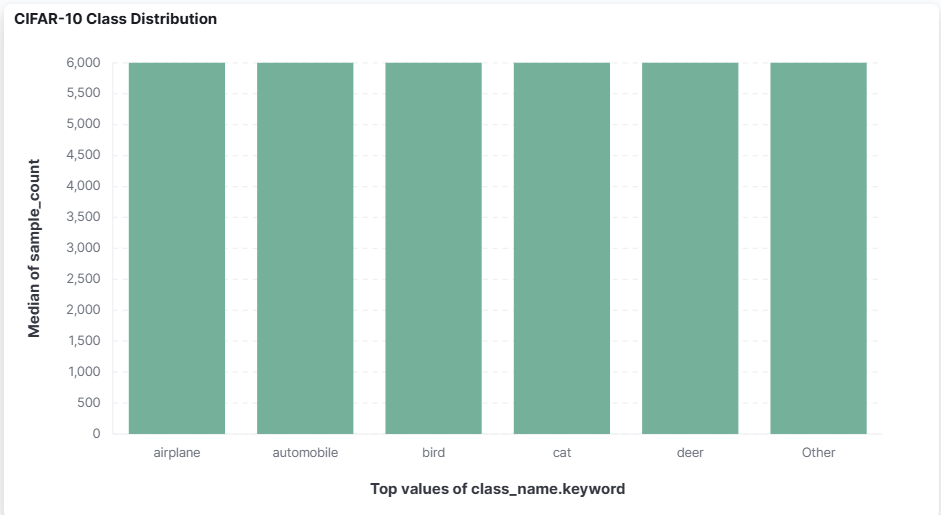
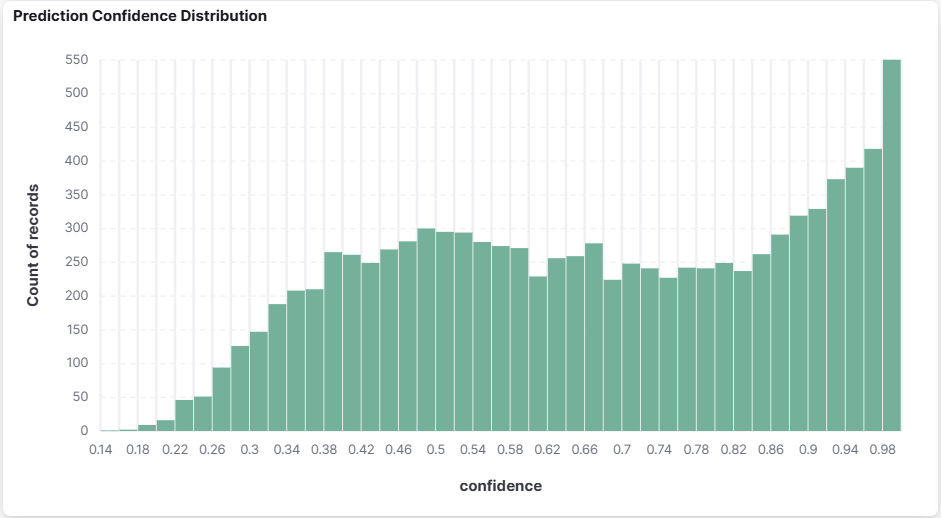
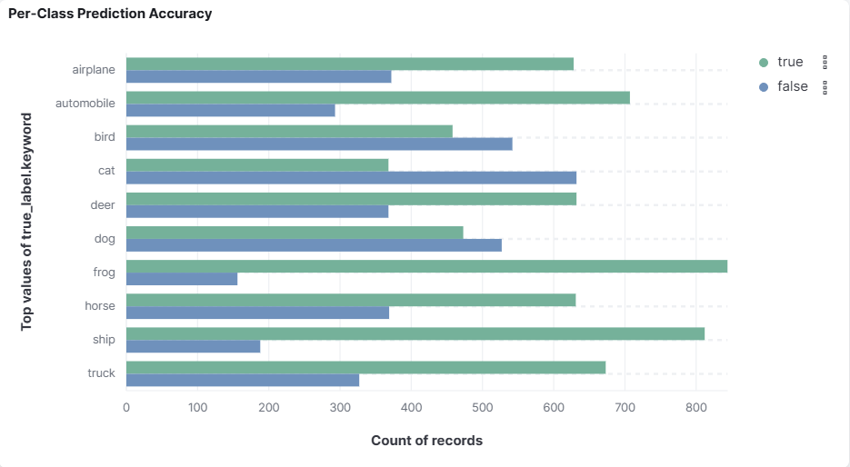
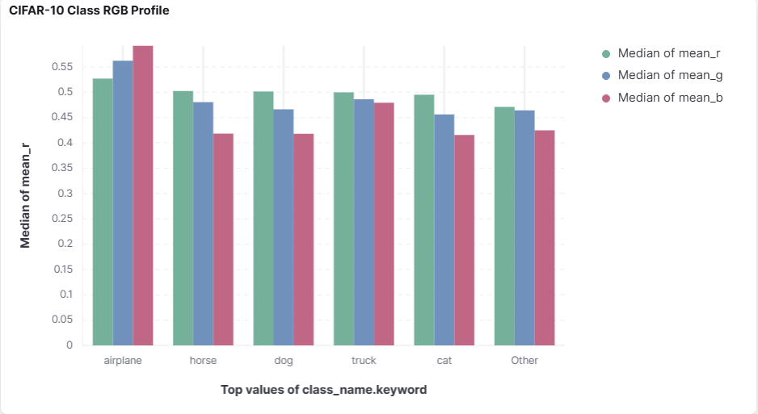

# ELK Lab 1 — CIFAR-10 ML Observability Pipeline

## Overview

This lab demonstrates using the **ELK Stack (Elasticsearch, Logstash, Kibana)** as an ML observability platform. It extends the original Lab 1 (Iris + Logistic Regression + manual WSL setup) by training a **CNN on CIFAR-10** inside a fully **Dockerized ELK stack**, routing metrics, predictions, and dataset statistics into Elasticsearch for visualization in Kibana.

| | Original Lab | This Lab |
|---|---|---|
| Setup | Manual WSL/Ubuntu install | Docker Compose |
| Dataset | Iris (150 samples) | CIFAR-10 (60,000 images) |
| Model | Logistic Regression | 3-block CNN |
| Logging | File → Logstash → ES | File → Logstash → ES + direct ES indexing |
| Elasticsearch indices | `logstash-training` | `cifar10-training-metrics`, `cifar10-predictions`, `cifar10-dataset-stats`, `cifar10-logstash-*` |
| Dataset analysis | None | Per-class RGB statistics |
| Prediction tracking | None | Per-sample true label, predicted label, confidence |
| Kibana dashboards | None | 5 visualizations in a unified dashboard |

---

## Architecture

```
┌─────────────────────────────────────────────────────┐
│                   train_model.py                     │
│                                                      │
│  CIFAR-10 CNN Training                               │
│       │                                              │
│       ├──► logstash/training.log                     │
│       │         │                                    │
│       │         └──► Logstash ──► cifar10-logstash-* │
│       │                                              │
│       └──► Elasticsearch (direct)                    │
│                 ├── cifar10-training-metrics         │
│                 └── cifar10-predictions              │
│                                                      │
│  src/visualize_dataset.py                            │
│       └──► Elasticsearch (direct)                    │
│                 └── cifar10-dataset-stats            │
└─────────────────────────────────────────────────────┘
                        │
                    Kibana :5601
```

---

## Project Structure

```
Lab1_Setup_Windows_WSL_Ubuntu/
├── src/
│   ├── es_client.py            # Elasticsearch connection + indexing helpers
│   └── visualize_dataset.py    # Logs CIFAR-10 dataset statistics to ES
├── logstash/
│   ├── logstash.conf           # Grok pipeline for training.log
│   └── training.log            # Generated at runtime by train_model.py
├── assets/                     # Kibana dashboard screenshots
├── train_model.py              # CNN training + ELK logging
├── docker-compose.yaml         # ELK stack (Elasticsearch, Logstash, Kibana)
├── requirements.txt
└── README.md
```

---

## Elasticsearch Indices

| Index | Documents | Contents |
|---|---|---|
| `cifar10-training-metrics` | 10 (one per epoch) | Loss, accuracy, val_loss, val_accuracy |
| `cifar10-predictions` | 10,000 | True label, predicted label, confidence, correct |
| `cifar10-dataset-stats` | 10 (one per class) | Per-class RGB mean/std, sample count, brightness |
| `cifar10-logstash-*` | 108 | Raw parsed log lines from training.log |

---

## Kibana Dashboard


*Unified ML observability dashboard — training curves, dataset analysis, and prediction breakdown in one view.*

---

### Training Curves


*Val loss decreasing and val accuracy increasing over 10 epochs, tracked per-epoch via `ELKLoggerCallback` and indexed directly into Elasticsearch.*

---

### Dataset Class Distribution


*CIFAR-10 is perfectly balanced — 6,000 samples per class across train + test. Indexed via `visualize_dataset.py` into `cifar10-dataset-stats`.*

---

### Prediction Confidence Distribution


*Distribution of model confidence scores across 10,000 test predictions. The right-skewed distribution shows the model is generally confident — most predictions cluster above 0.8.*

---

### Per-Class Prediction Accuracy


*True (green) vs false (blue) predictions per class. `frog` and `ship` are easiest for the model; `cat` and `bird` have the most misclassifications — a known challenge in CIFAR-10.*

---

### Class RGB Color Profile


*Per-class mean RGB values across all samples. Shows the natural color characteristics of each class — useful context for understanding why visually similar classes (e.g. `cat` vs `dog`) are harder to classify.*

---

## Setup & Usage

### Prerequisites
- Docker Desktop running (4GB+ memory allocated)
- Python 3.8+

### 1. Install Python dependencies
```bash
pip install -r requirements.txt
```

### 2. Start the ELK stack
```bash
docker compose up
```
Wait until Kibana is available at `http://localhost:5601` (~60 seconds).

### 3. Index CIFAR-10 dataset statistics
```bash
python -m src.visualize_dataset
```

### 4. Train the model and log metrics
```bash
python train_model.py
```

### 5. View dashboards in Kibana
- Open `http://localhost:5601`
- Go to **Dashboard → CIFAR-10 ML Observability Dashboard**

### 6. Stop the stack
```bash
docker compose down
```

---

## Dependencies
- `tensorflow >= 2.10.0`
- `elasticsearch >= 7.16.0, < 8.0.0`
- `numpy >= 1.23.0`
- `scikit-learn >= 1.0.0`