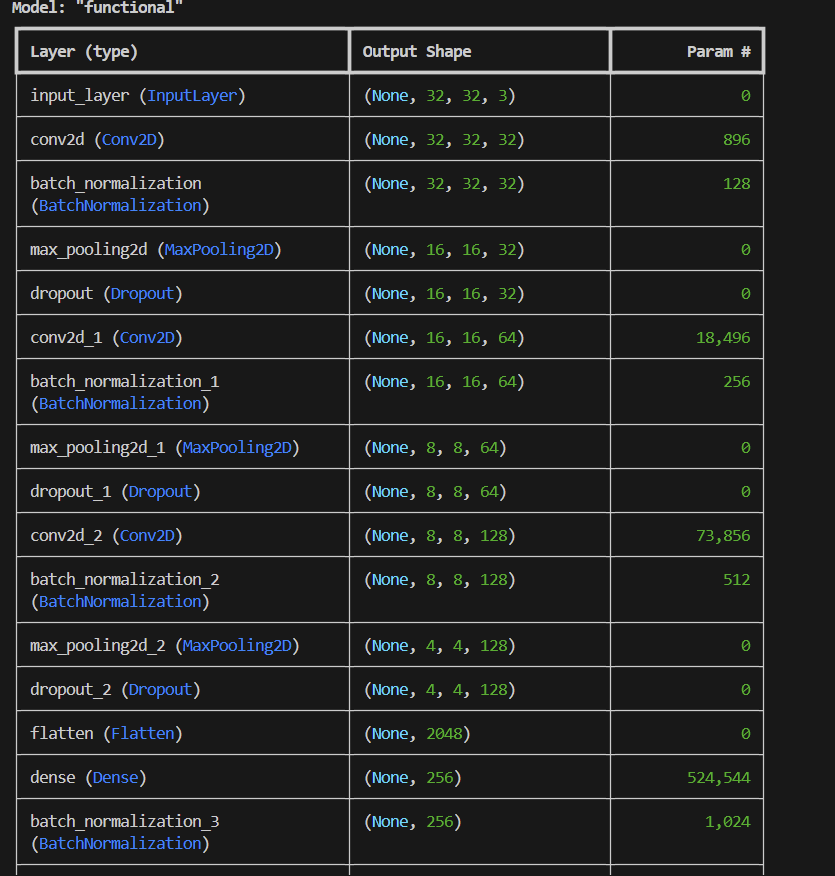
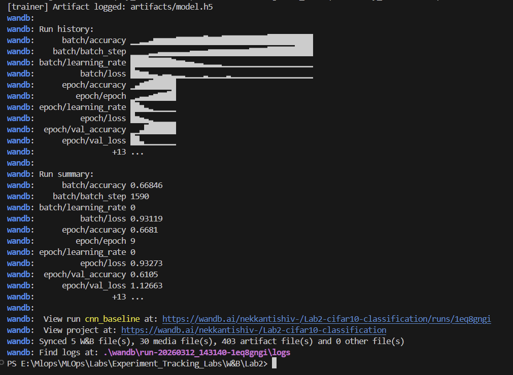
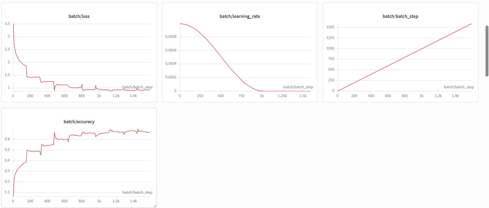
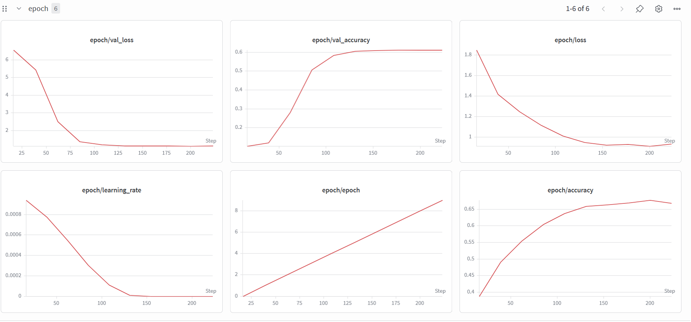
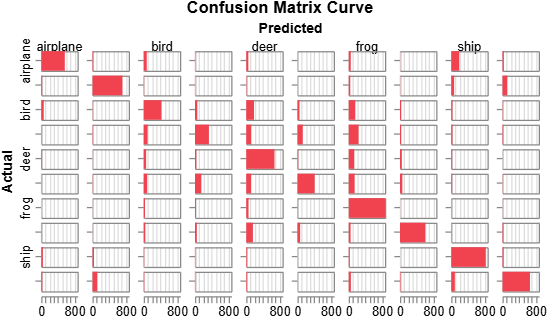
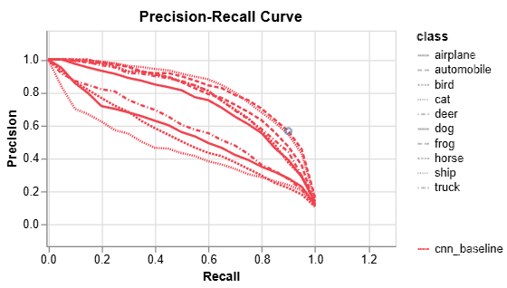
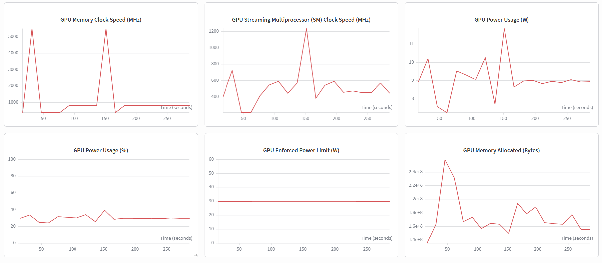

# W&B Lab 2 — CIFAR-10 Classification with Experiment Tracking

## Overview

This lab demonstrates experiment tracking with [Weights & Biases](https://wandb.ai) on a **CIFAR-10 image classification** task using a deep CNN. It extends the original Lab 2 (Fashion MNIST + simple CNN) with a stronger architecture, richer logging, and a hyperparameter sweep.

| | Original Lab | This Lab |
|---|---|---|
| Dataset | Fashion MNIST (28×28 grayscale) | CIFAR-10 (32×32 color) |
| Architecture | 1 Conv block, no BN | 3 Conv blocks + Batch Normalization |
| Optimizer | SGD (fixed LR) | Adam + Cosine Decay schedule |
| WandB logging | Metrics, LR, samples, confusion matrix | + Per-class accuracy, gradient histograms, PR curves |
| Hyperparameter tuning | None | Bayesian sweep over 4 parameters |
| Project structure | Single notebook | Modular Python project |

---

## Project Structure

```
Lab2/
├── src/
│   ├── __init__.py
│   ├── data.py           # CIFAR-10 loading and preprocessing
│   ├── model.py          # CNN architecture definition
│   ├── callbacks.py      # Custom WandB callbacks
│   └── trainer.py        # Training loop and artifact logging
├── assets/               # Screenshots from WandB dashboard
├── artifacts/            # Saved model + summary (gitignored)
├── checkpoints/          # Per-epoch model checkpoints (gitignored)
├── main.py               # Single run entry point
├── sweep.py              # Hyperparameter sweep entry point
├── sweep_config.yaml     # Sweep search space configuration
├── requirements.txt
└── README.md
```

---

## Model Architecture

A 3-block CNN with a 2-layer classification head:

```
Input (32×32×3)
 └── Block 1: Conv2D(32)  → BatchNorm → MaxPool → Dropout
 └── Block 2: Conv2D(64)  → BatchNorm → MaxPool → Dropout
 └── Block 3: Conv2D(128) → BatchNorm → MaxPool → Dropout
 └── Flatten
 └── Dense(256) → BatchNorm → Dropout
 └── Dense(10, softmax)
```


*Model summary logged as a WandB artifact alongside the saved `.h5` weights, making every run's architecture fully reproducible.*

---

## Experiment Tracking with WandB

### Training Run Output


*WandB syncs metrics, media, and artifacts automatically at the end of each run — 30 media files and 403 artifact files logged in a single baseline run.*

---

### Batch-Level Metrics


*Batch-level loss, accuracy, and cosine-decayed learning rate tracked across all 1,590 steps. The cosine decay schedule is clearly visible — LR smoothly anneals to zero rather than dropping abruptly.*

---

### Epoch-Level Metrics


*Epoch-level train/val loss and accuracy tracked alongside the learning rate schedule. WandB makes it easy to spot overfitting gaps between train and val curves across runs.*

---

### Confusion Matrix


*Per-class confusion matrix logged every epoch via `ConfusionMatrixCallback`. Tracking this over epochs reveals which classes are learned early vs which remain confused throughout training.*

---

### Precision-Recall Curves


*Per-class PR curves logged via `PRCurveCallback` — a new addition not present in the original lab. PR curves are more informative than accuracy alone for evaluating multi-class classification, particularly for classes with imbalanced representation.*

---

### GPU Utilization


*WandB automatically tracks GPU memory, clock speed, and power usage throughout training. This is critical in MLOps for understanding resource costs across different model configurations and sweep trials.*

---

## WandB Callbacks Summary

| Callback | What it tracks | New vs Original |
|---|---|---|
| `WandbMetricsLogger` | Batch and epoch loss/accuracy | Same |
| `LogLRCallback` | Learning rate per epoch | Same |
| `LogSamplesCallback` | Prediction table with images | Same |
| `ConfusionMatrixCallback` | Full validation confusion matrix | Same |
| `PerClassAccuracyCallback` | Per-class accuracy breakdown | **New** |
| `GradientHistogramCallback` | Weight gradient histograms | **New** |
| `PRCurveCallback` | Per-class precision-recall curves | **New** |

---

## Hyperparameter Sweep

The sweep uses **Bayesian search** to find the best combination of:

| Parameter | Search Space |
|---|---|
| `learn_rate` | log-uniform [0.0001, 0.01] |
| `dropout` | {0.1, 0.2, 0.3, 0.4} |
| `layer_1_size` | {32, 64} |
| `batch_size` | {32, 64, 128} |

Sweep runs use 10k samples and 5 epochs for speed. The best config can then be re-run with `sample=None` for a full training run.

---

## Setup & Usage

### Install dependencies

```bash
pip install -r requirements.txt
```

### Login to WandB

```bash
wandb login
```

### Single training run

```bash
python main.py
```

### Hyperparameter sweep (10 trials)

```bash
python sweep.py
```

## Dependencies

- `tensorflow >= 2.10.0`
- `wandb >= 0.15.0`
- `numpy >= 1.23.0`
- `pyyaml >= 6.0`